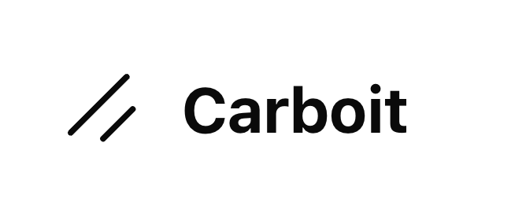

<div align="center">
  
</div>

<h1 align="center">
  Next.js Template
  <br>
</h1>
<h4 align="center">Free, open-source Next.js template with Shadcn and Tailwind for swift and modern web development.</h4>
<p align="center">
  <a href="#key-features">Key Features</a> •
  <a href="#dependencies">Dependencies</a> •
  <a href="#how-to-use">How To Use</a> •
  <a href="#documentation">Documentation</a> •
  <a href="#faq">FAQ</a>
</p>

## Key Features
- SEO friendly.
- Navbar with a responsive menu.
- Hero section.
- Contact form with validation.
- Authentication. 
  - Sign up.
  - Sign in.
  - Forgot password.
  - Reset password.
  - FA and Google authentication.

## Dependencies
- [Next.js](https://nextjs.org/learn)
- [shadcn/ui](https://ui.shadcn.com/)
- [package.json](package.json)

## How To Use

### Environment Variables

Create a `.env.local` file in the root of the project and add the following environment variables.

```bash
WEB_SITE_URL= 

DATABASE_URL=

RESEND_API_KEY=

AUTH_GOOGLE_CLIENT_ID=
AUTH_GOOGLE_CLIENT_SECRET=
AUTH_SECRET=
```

This is website was generated
with [Next.js](https://nextjs.org/) project bootstrapped with [`create-next-app`](https://github.com/vercel/next.js/tree/canary/packages/create-next-app).

- Make sure you have the dependencies installed and running.

### Getting Started

First, run the development server:

```bash
npm run dev
# or
yarn dev
# or
pnpm dev
# or
bun dev
```

Open [http://localhost:3000](http://localhost:3000) with your browser to see the result.

## Documentation

## FAQ
